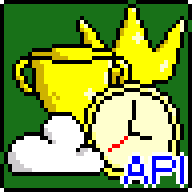

# 🏆 Collection of API for Clickteam Fusion 2.5
Единый модуль с набором готовых решений для обращений к API различных платформ. Модуль отвечает за получение достижений, отправку рекордов, за отправку сохранений в облако и за прочие вещи, и все эти вещи работают на платформах из списка ниже.

Цель модуля — быстрое внедрение комплекса обращений к API в готовые игры.

## Как использовать
📒 Инструкции вы найдёте в файле `Collection of API.mfa` на фрейме «Служебное. API».

🌐 Для HTML5-приложений вы должны использовать содержимое папки `Collection of API HTML5`. Измените файлы `index.html`, `background.png` и `favicon.png`, под своё приложение. Перед сборкой приложения укажите в свойствах приложения:
- Сгенерировать HTML файл: `Нет`
- Папка медиа: data
- Исходная папка: data
Рекомендуется прочитать файлы `_README.txt`, находящиеся в подпапках.

📱 При сборке приложения на Андроид минимальной версией должна быть указана 5.0, целевой 14.0, а номером API сборки должно быть 34.
## Платформы
- Game Jolt
- Steam
- VK Play
- Google Play
- Newgrounds
- VK Games
- Yandex Games
## Возможности
- Инициализация и вход
- Достижения
- Списки лидеров
- Облачное сохранение
- Получение серверного времени
- Реклама
- Покупки
## Требования
- Clickteam Fusion 2.5 версии R295.10 и выше
- Clickteam Fusion 2.5+
- Clickteam Fusion 2.5 Developer
- Clickteam Fusion 2.5 - Android Exporter
- Clickteam Fusion 2.5 - HTML5 Exporter
## Требуемые расширения
- AESFusion Object
- Google Play Games Connect
- Google Play Games Achievements
- Google Play Games Leaderboards
- Google Play Games Saved Games
- Google Play Games Quests
- Get Object
- Steamworks
- String Parser
- String Tokenizer
- Vitalize! plugin
- Yandex Ads
## Бонус
Так как по большей части я делал этот модуль для себя, я встроил в него ещё несколько штук, чтобы я быстро внедрял их в свои игры. Если они вам не нужны, большинство их них можно безопасно удалить.
- Переключатель полноэкранного режима (Windows и HTML5);
- Объект громкостей звука;
- Контроллер музыки (пока не тестировался и не использовался);
- Время и пауза (пока не тестировалось и не использовалось);
- Тряска экрана (слоя);
- Получить язык браузера;
- Файлы игры (лучше не удалять, так как имеет косвенную связь с модулем, но пути к ini можно указать по своему);
- Открыть ссылку (готовое решение открытия ссылок для всех платформ);
- Ответы JS (не удалять, необходим для работы модуля).
## Упрощённые версии модуля
Если вам необходима версия, где вырезаны какие-то расширения и связанные с ними функции, оставляйте свои заявки в разделе «Issues» с меткой «Запрос упрощения».
## Список функций
### Кратко
|Платформа|Достижения|Рекорды|Облако|Реклама|Покупки|Время|
|---|---|---|---|---|---|---|
|GameJolt|✅|✅|✅|||✅|
|Steam|✅|✅|Автоматически¹|||Через GJ API²|
|VK Play|✅||Автоматически¹|||Через GJ API²|
|itch.io||||||Через GJ API²|
|Google Play|✅|✅|✅|Яндекс Реклама|Не тестировалось|Через GJ API²|
|RuStore||||||Через GJ API²|
|Yandex Games||Только отправка||✅||✅|
|VK Games||||✅|||
|Newgrounds|✅|✅|✅|||✅|

¹ Фактически функционал не реализован в модуле. Здесь расчёт на то, что облачное сохранение будет настроено на автоматическое в дэшборде вашей игры с указанием путей к файлам сохранений.
² У платформы нет или не обнаружен метод получения серверного времени, поэтому используется получение времени через Game Jolt API.
### Подробно
➡️ [**Полная сводка функций модуля API**](https://docs.google.com/spreadsheets/d/15JrQRcRoXMjtDFZX1ss9JBfCUiWzbi4q)
